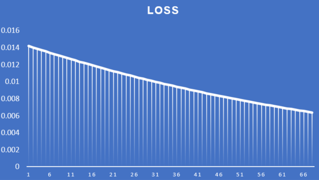
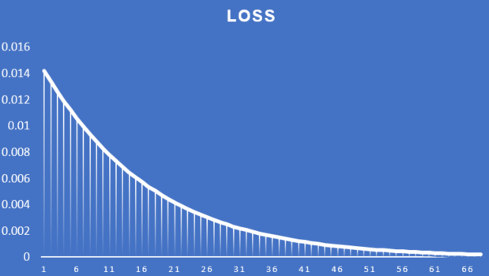

# 1. Question

* PART 1[250]: Rewrite the whole Excel sheet showing backpropagation. Explain each major step, and write it on GitHub. 
* Use exactly the same values for all variables as used in the class
* Take a screenshot, and show that screenshot in the readme file
* The Excel file must be there for us to cross-check the image shown on readme (no image = no score)
* Explain each major step
* Show what happens to the error graph when you change the learning rate from [0.1, 0.2, 0.5, 0.8, 1.0, 2.0] 
* Upload all this to GitHub and then write all the above as part 1 of your README.md file. 
* Submit details to S6 - Assignment QnA. 

# 2. The graph

## 2.1 Dividing into smaller sections

### 2.1.1 h1

$$h1 = w1*i1 + w2*i2$$

______________________________________________________

### 2.1.2 h2

$$h2 = w3*i1 + w4*i2$$

______________________________________________________

### 2.1.3 a_h1

$$a_{h1} = σ(h1) = 1/(1 + exp(-h1))$$

______________________________________________________

### 2.1.4 a_h2

$$a_{h2} = σ(h2)$$

______________________________________________________

### 2.1.5 Rest of the Calculations

Similarly we can write the following:

* $$o_1 = w5 * a_{h1} + w6*a_{h2}	$$	

* $$o_2 = w7 * a_{h1} + w8*a_{h2}	$$	

* $$a_{o1} = σ(o1)		$$

* $$a_{o2} = σ(o2)$$	

* $$E_{total} = E1 + E2		$$

* $$E_1 = ½ * (t_1 - a_{o1})²	$$

* $$E_2 = ½ * (t_2 - a_{o2})²		$$

## 2.2 Backpropagation

## E_total to w5

Now lets see how back propagation works. We will start with backpropagating E_total to w5.

This is the step-by-step breakdown of the backpropagation process for calculating the partial derivative of the total error with respect to the weight parameter w5.

1. Initially, we have the expression for the total error as E_total = E1 + E2, where E1 and E2 are individual error terms.

2. To compute the partial derivative of E_total with respect to w5, we can focus solely on E1 because E2 does not involve w5. Hence, we have ∂E_total/∂w5 = ∂E1/∂w5.

3. Now, let's calculate ∂E1/∂w5. This can be expanded using the chain rule:

   $$∂E1/∂w5 = (∂E1/∂a_{o1}) * (∂a_{o1}/∂o1) * (∂o1/∂w5)$$

4. ∂E1/∂a_o1 represents the partial derivative of E1 with respect to the output activation a_o1. It measures how changes in a_o1 affect E1. In this case, E1 is given as (1/2) * (t1 - a_o1)^2, where t1 is the target value for the output unit.

   So, $$∂E1/∂a_o1 = ∂(1/2 * (t1 - a_{o1})^2)/∂a_{o}1 = (a_{o1} - t1)$$

5. ∂a_o1/∂o1 is the partial derivative of the output activation a_o1 with respect to the weighted sum o1. Here, σ() represents the activation function (e.g., sigmoid function) applied to o1.

   $$∂a_{o1}/∂o1 = ∂(σ(o1))/∂o1 = σ(o1) * (1 - σ(o1)) = a_{o1} * (1 - a_{o1})$$

6. Finally, ∂o1/∂w5 represents the partial derivative of the weighted sum o1 with respect to w5. In this case, o1 is the weighted sum of the inputs to the output unit, which includes the activation of the hidden unit h1.

   $$∂o1/∂w5 = a_{h1}$$

Therefore, combining all the derivatives, we get:

$$∂E_{total}/∂w5 = ∂E1/∂w5 = ∂E1/∂a_{o1} * ∂a_{o1}/∂o1 * ∂o1/∂w5
              = (a_{o1} - t1) * (a_{o1} * (1 - a_{o1})) * a_{h1}$$

Here is the same calculation:

## 2.3 Rest of the calcuation

Hence the ∂E_total wrt to w1 w2 w3 w4 can be written as:

## 2.4 Updating weights

To update a weight we use the following formula

$$ weight_{new} = weight_{old}-LR*Gradient$$

Hence we can update w1 by formula:

 $$w_{1new}= w1 * ∇_{w1} E_{total}$$

# 3. Loss Curves for different LR

## 0.1

## 0.2

## 0.5

## 0.8

## 1

## 2

# 4. Appendix

## Useful differential formulas

